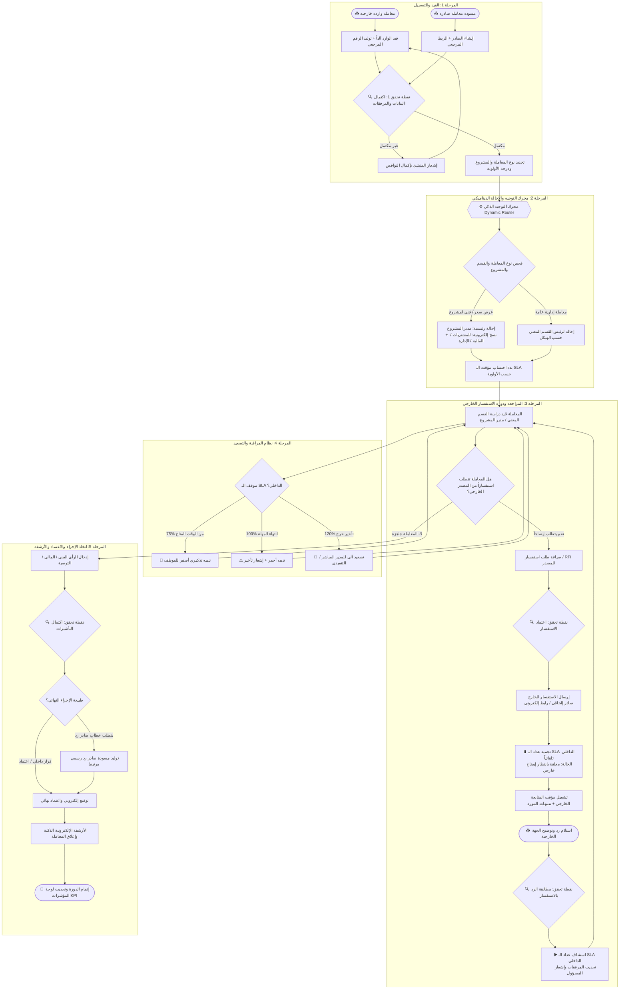
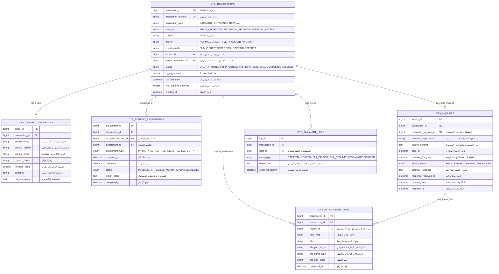

# 📑 وثيقة المتطلبات الهندسية والمخطط التقني لنظام الاتصالات الإدارية
## وحدة الاتصالات الإدارية وتدفق المعاملات (ERP Administrative Correspondence & Workflow System)

---

## 📌 1. نظرة عامة ونطاق النظام (System Scope & Objectives)

تهدف هذه الوثيقة إلى توفير المواصفات التقنية والمعمارية الكاملة لبناء وحدة **الاتصالات الإدارية (CTS - Correspondence Tracking System)** ضمن نظام الـ **ERP**.

### النطاق الوظيفي (Functional Scope):
1. **إدارة المعاملات الواردة والصادرة:** تسجيل، قيد إلكتروني، باركود، وأرشفة رقمية للمرفقات والروابط.
2. **محرك التوجيه الديناميكي (Dynamic Routing Engine):** إحالة المعاملات تلقائياً (مثل عروض الأسعار والمعاملات الفنية) إلى مدراء المشاريع والأقسام المعنية والإدارة التنفيذية بناءً على الهيكل التنظيمي للمنشأة.
3. **دورة الاستفسارات الخارجية (External Clarification / RFI Loop):** تمكين الأقسام من طلب إيضاحات من الموردين/الجهات المصدرة، مع **تجميد عداد الـ SLA آلياً** لحماية مؤشرات أداء الموظفين الداخليين.
4. **نظام المتابعة والتنبيهات الموقوتة (SLA & Escalation Engine):** مراقبة دقيقة للمهل الزمنية، إرسال تذكيرات ذكية، وتصعيد تلقائي عند التأخير.
5. **مصفوفة نقاط التحقق والرقابة (Verification Checkpoints):** تطبيق شروط جودة صارمة عند كل انتقال في دورة حياة المعاملة.

---

## 🔄 2. مخطط تدفق العمليات الشامل (End-to-End Workflow Diagram)



---

## 🛡️ 3. مصفوفة نقاط التحقق والرقابة الذكية (Verification Checkpoints)

| رمز النقطة | المرحلة | نوع الفحص | الشروط البرمجية الإلزامية (System Rules) | الإجراء في حال عدم المطابقة |
| :--- | :--- | :--- | :--- | :--- |
| **VP-01** | تسجيل المعاملة | آلي + مدخل البيانات | - سلامة الملفات المرفقة وصيغها (PDF, Excel, Images).<br>- صلاحية الروابط الخارجية (URL Validation).<br>- تحديد الجهة المصدرة ونوع المعاملة. | منع إنشاء القيد وتحديد الحقول الناقصة باللون الأحمر. |
| **VP-02** | محرك التوجيه | آلي (System) | - مطابقة المعاملة مع شجرة الهيكل التنظيمي للمنشأة.<br>- فحص جدول التفويضات والبدلاء (Delegation Rules) في حال إجازة المسؤول. | في حال عدم وجود معين، يتم توجيه المعاملة تلقائياً للمدير المباشر لمنصب المسؤول. |
| **VP-03A** | صياغة الاستفسار الخارجي | إداري | - وضوح بنود الاستفسار والنواقص الفنية أو المالية.<br>- عدم تكرار استفسار مجاب عنه سابقاً. | بقاء مسودة الاستفسار معلقة حتى يعتمدها مدير الإدارة أو مدير المشروع. |
| **VP-03B** | استلام الرد الخارجي | آلي | - مطابقة الرقم المرجعي للاستفسار (Inquiry Token/ID).<br>- التأكد من وجود رد نصي ومرفقات إيضاحية. | إخطار موظف الاتصالات الإدارية للتدخل اليدوي في حال كان الرد مجهول المرجع. |
| **VP-04** | تدقيق الإجراء المنجز | آلي + إداري | - مطابقة الصلاحيات المالية في حال كان عرض السعر يتجاوز حد صلاحية المدير.<br>- اكتمال تأشيرات جميع الأطراف المحال لهم للرأي. | رفض إغلاق المعاملة أو تصديرها، وإلزام النظام بطلب موافقة المستوى الأعلى. |
| **VP-05** | التصدير والأرشفة | آلي | - ربط رقم الصادر برقم الوارد الأساسي في قاعدة البيانات.<br>- وضع الختم الإلكتروني والباركود/QR Code المعتمد. | منع التصدير إلا بعد توليد ملف PDF النهائي المدمج والمختوم رقمياً. |

---

## ⚙️ 4. محرك التوجيه الذكي وقواعد الأعمال (Dynamic Business Rules)

### قاعدة توجيه عروض الأسعار والمعاملات الفنية:
```python
IF transaction.category == "PRICE_QUOTATION":
    # 1. الإحالة الرئيسية للأصل
    IF transaction.project_id IS NOT NULL:
        assign_primary_action(to=project.project_manager, sla_hours=48)
        assign_review(to=project.technical_engineer, sla_hours=48)
    ELSE:
        assign_primary_action(to=department.procurement_manager, sla_hours=48)

    # 2. إحالة النسخ الإلكترونية (للمتابعة والإشراف)
    assign_cc(to=department.finance_manager)
    IF transaction.estimated_value > 100000:
        assign_cc(to=executive_management.ceo_office)

    # 3. تفعيل عداد الـ SLA
    set_priority(level="URGENT")
```

---

## ⏱️ 5. محرك الـ SLA والتنبيهات وإدارة تجميد الوقت (SLA & Pause Logic)

### أ. مصفوفة الأولويات والمهل الزمنية:
* **عادي (Normal):** مهلة الرد `72 ساعة عمل`.
* **عاجل (Urgent):** مهلة الرد `48 ساعة عمل`.
* **عاجل جداً (Very Urgent):** مهلة الرد `24 ساعة عمل`.
* **فوري / سري للغاية (Instant):** مهلة الرد `8 ساعات عمل`.

### ب. خوارزمية تجميد واستئناف الـ SLA (Clock Pause Algorithm):
```text
[المعاملة لدى الموظف] ──(طلب استفسار خارجي)──> [إيقاف مؤقت العداد: Record Paused_At]
                                                        │
                                          (انتظار رد المورد الخارجي)
                                                        │
[استئناف العداد] <──(استلام الرد الخارجي)─── [احتساب مدة التجميد وإضافتها للموعد النهائي]
New_Due_Date = Original_Due_Date + Total_Paused_Duration
```

### ج. درجات الإشعارات والتصعيد:
1. **تنبيه 75% (تذكير أصفر):** إشعار عبر النظام + بريد إلكتروني للموظف المسؤول.
2. **تنبيه 100% (تنبيه أحمر):** إشعار بتجاوز المهلة للموظف ومديره المباشر.
3. **تنبيه 120% (تصعيد أرجواني):** تصعيد المعاملة لمدير القطاع مع إدراجها في تقرير المعاملات المتعثرة.

---

## 🗄️ 6. مخطط هيكل قاعدة البيانات (Data Model / ERD)



---

## 🔌 7. مواصفات التكامل البرمجي (ERP Integration APIs)

### 1. نقطة استلام وإنشاء المعاملة:
`POST /api/v1/cts/transactions`
```json
{
  "transaction_type": "INCOMING",
  "category": "PRICE_QUOTATION",
  "subject": "عرض سعر توريد معدات مشروع أبراج الرياض",
  "priority": "URGENT",
  "project_id": 1042,
  "details": {
    "sender_entity": "شركة التوريدات العالمية",
    "contact_email": "sales@supplies.com",
    "financial_value": 450000.00,
    "currency": "SAR"
  },
  "attachments": [
    {
      "item_type": "FILE",
      "title": "جدول الكميات والتسعير BOQ.xlsx",
      "file_path_or_url": "/storage/cts/2026/09/boq_450k.xlsx"
    },
    {
      "item_type": "URL_LINK",
      "title": "رابط الكتالوج الفني للمعدات",
      "file_path_or_url": "https://specs.supplies.com/v2/catalog"
    }
  ]
}
```

### 2. نقطة إرسال استفسار خارجي وتجميد الـ SLA:
`POST /api/v1/cts/transactions/{id}/inquiries`
```json
{
  "inquiry_content": "يرجى توضيح فترة الضمان للمضخات وما إذا كان السعر يشمل التركيب والتشغيل.",
  "external_target_email": "sales@supplies.com",
  "external_due_hours": 48
}
```
* **الاستجابة التلقائية للنظام:**
  * توليد رقم استفسار فريد مع رابط رد رقمي آمن.
  * تحديث حالة المعاملة إلى `PENDING_EXTERNAL_CLARIFICATION`.
  * تجميد عداد الـ SLA وتسجيل الحدث في `CTS_SLA_AUDIT_LOGS`.

---

## 📋 8. قائمة المتطلبات غير الوظيفية (Non-Functional Requirements)

1. **الأمان والسرية (Security & RBAC):** حجب مرفقات وتفاصيل المعاملات السرية عن الموظفين غير المعنيين، مع تشفير المرفقات الحساسة (AES-256).
2. **سجل التدقيق الكامل (Audit Trail):** تسجيل كل عملية فتح، تنزيل، تأشيرة، أو تحويل بالثانية واسم المستخدم وعنوان الـ IP.
3. **الأداء العالي (High Performance):** استجابة محرك التوجيه وتوليد التنبيهات في أقل من 500 ميلي ثانية.
4. **التوافق والاستقلالية (Portability):** يمكن نقل هذا المخطط وتطبيقه على قواعد بيانات (PostgreSQL, MS SQL Server, Oracle) وعلى أطر عمل (NestJS, Laravel, Django, .NET Core).
